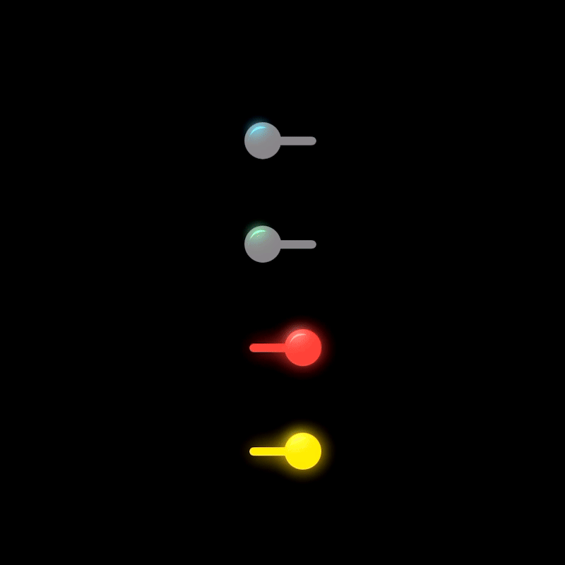

# FluidToggleStyle

A custom SwiftUI Toggle Style inspired by neumorphic fluid laser animations. I developed this for my mental math practice app, "CountQuick!":
https://apps.apple.com/us/app/countquick/id1547824784

Apply it to your existing toggle by adding ".toggleStyle(FluidToggle(turnsOff: true, color: Color.blue))" and '.animation(.fluidBounce)' to the bool assigned to the toggle. It acts the same in Dark/Light modes.

The "turnsOff" boolean is for those toggles where the choice is between two different options rather than turning a feature on or off. If "turnsOff" is set to true - the 'false' toggle gets rid of color, signalling that something has been turned off. The bottom two examples in the GIF demonstrate what happens if "turnsOff" is set to false.

## Illustration

## Details
- iOS 15+
- Xcode 13+
- Swift 5+
